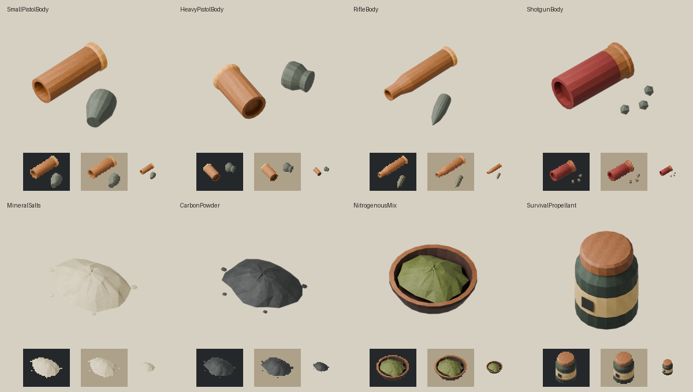
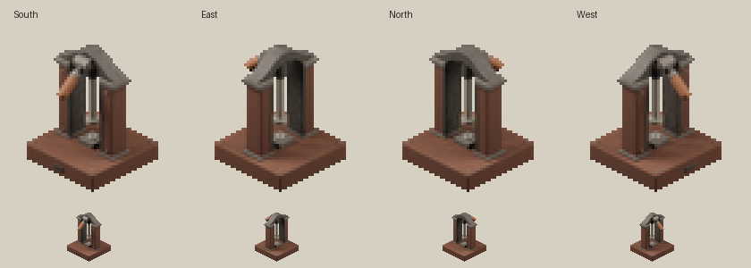

# 탄약 자산 수정 — 2026-09-22

[모델 점검 보고서](MODEL-REVIEW-2026-09-22.md)의 몸체·재료·프레스 개선을 적용했다.
기존 프레스 `.blend`를 Blender API로 직접 편집했고, 새 부품 8종은 별도의 편집 가능한
`.blend`에 보존했다. 모델 원본을 매번 재생성하던 경로는 폐기하고 원본을 읽기만 하는
내보내기·렌더 과정으로 바꿨다. 버전은 기존 1.1.0 릴리스 후보를 유지한다.

## 적용 자산

큰 그림은 각 모델을 화면에 맞춘 Blender 검사 렌더이고, 아래는 어두운/밝은 배경에서
2배 확대 및 원래 32px 크기로 본 배포 아이콘이다. 게임 스크린샷이나 상대 크기 비교가 아니다.

| 아이템 | 적용 내용 |
|---|---|
| 소형 권총 몸체 | 열린 황동 탄피 + 분리된 둥근 금속 촉 |
| 대형 권총 몸체 | 굵고 짧은 탄피 + 납작한 끝의 촉, 소형과 다른 배치 방향 |
| 소총 몸체 | 길고 목이 좁아지는 탄피 + 길쭉한 촉 |
| 산탄총 몸체 | 열린 붉은 탄피 + 작은 산탄 조각 3개 |
| 광물 가루 | 낮고 밝은 가루 더미와 작은 알갱이 |
| 탄소 가루 | 낮고 어두운 가루 더미와 작은 알갱이 |
| 질소질 혼합물 | 갈색 그릇과 테두리, 올리브색 혼합물 |
| 야전 화약 | 불투명 녹색 용기, 황토색 뚜껑, 구분용 띠 |

부품은 한 개의 256×256 아틀라스를 공유한다. 배포 FBX는 각각 한 메시·한 재질·한 UV
레이어이며 원본에서는 탄피·촉·그릇 등 부위를 따로 편집할 수 있다. 기존 아이템·레시피·번역
ID는 그대로다. 제작 결과인 완성 탄약 9종과 교본 3권의 바닐라 자산도 유지했다.
교본 표지 통일은 점검 보고서의 낮은 우선순위 선택 사항으로 남겨 두었다.

## 프레스

기존 받침·기둥·아치·회전축과 카메라는 유지했다. 손잡이 목재의 명도를 높이고,
램/작업부에 더 밝은 금속을 적용했으며, 철 표면의 과한 미세 요철을 줄였다.
상부 사각 작업판은 낮은 팔각형으로 직접 수정했다. 네 방향 타일, pack, 아이콘과
고해상도 프리뷰를 다시 만들었다. 공통 받침 투영 크기 50.12×31.33px와 기준점은 유지한다.

## 원본과 생성물 관리

- `source-assets/blender/AuxiliasAmmunitionPress.blend`: 기존 프레스에 직접 수정 적용.
- `source-assets/blender/AuxiliasAmmunitionParts.blend`: 8개 부품 컬렉션, 편집 가능한
  메시·UV 및 패킹된 아틀라스. 처음 열면 소형 권총 몸체가 보인다.
- `tools/export-parts.py`: 원본을 평가한 복사본만 내보내고, 모든 삼각형 좌표·방향·UV를
  FBX 재가져오기로 비교한다. 원본 저장/형상 재생성은 하지 않는다.
- `source-assets/blender/parts-manifest.json`: 현재 원본·아틀라스·FBX 해시와 실측 결과.
- `tools/build-icons.py` → `tools/sync-icons.ps1`: 단일 아이콘 경로. 32px에서 최대 24색,
  이진 알파와 여백을 사용하고, 128px 마스터는 같은 픽셀의 4배 확대본이다.
- 이전 `generate_ammo_press.py`와 `generate_body_icons.py`는 새 경로를 호출하는
  호환 진입점으로 변경해, 다시 실행해도 이번 편집을 이전 디자인으로 덮어쓰지 않는다.

재현 명령과 좌표·내보내기 규칙은 [MODELING.md](../MODELING.md)에 있다.
임시 편집 스크립트와 실행 로그는 저장소 `work/ammo-asset-refresh-2026-09-22`에 있다.
원본 파일이 최종 편집 기준이며 임시 스크립트 재실행은 업데이트 절차가 아니다.

## 검증 범위

8개 모델의 바닥 기준점, 크기 범위, 퇴화 삼각형과 붕괴 UV를 검사하고 FBX 재가져오기에서
원본의 좌표·삼각형 방향·UV를 비교한다. 배포 모델은 한 메시·한 재질·한 UV를 유지한다.
32px 아이콘 9개는 이진 알파·투명 여백·고유 해시와 128px 마스터의 픽셀 일치를 검사한다.
프레스 타일은 원본 셀과 실제 pack의 보이는 픽셀/알파를 비교한다.

**게임 클라이언트에서 새 외형의 배치·크기·바닥 접촉·조명은 아직 확인하지 않았다.**
받침 기준점을 보존하고 기존 저장소의 소품 내보내기 축 규칙을 사용했지만,
Blender 검사나 정적 검증을 실제 게임 합격으로 간주하지 않는다.
`TESTING.md`에 새 외형의 클라이언트 확인 항목을 추가했다.

### 최종 실행 결과

- 현재 배포 FBX 8개를 `--verify-only --no-render`로 다시 검증: 모두 통과.
  전체 2,838개 삼각형, 좌표·UV 최대 오차 약 `4.03e-9`로 허용치 `1e-6` 이내.
- 패킹된 아틀라스와 원본 PNG·배포 PNG 일치, 내보내기 전후 `.blend` 해시 유지.
- 프레스 원본 셀 4개로 재구성한 pack이 배포 pack과 바이트 단위로 일치.
  타일 정의도 기존 계약과 일치.
- `tools/validate.ps1`: 저장소의 모드 3개 모두 통과. 탄약 모드의 아이콘 9개,
  아이템 12개, 레시피 19개, EN/KO 번역 일치 검사 포함.
- `git diff --check`: 오류 없음.
- `tools/package.ps1 -Mod auxilias-ammunition -OutputDirectory dist/auxilias-ammunition/asset-refresh-2026-09-22` 완료.
  후보 ZIP: `dist/auxilias-ammunition/asset-refresh-2026-09-22/AuxiliasAmmunition-1.1.0.zip`.
  SHA-256: `7118bdeae7f13ef4d34c35e8911f533c722d8b8050999f5dc6aade523f7361a7`.

이 최초 패키지는 로컬 검토용 후보로 만들었고, 이후 사용자 요청으로 로컬 배포했다.
Workshop 게시를 수행하지 않았다.

### 로컬 배포 후 방향 보정

사용자 게임 화면에서 부품들이 옆으로 기울어진 문제가 확인되었다. 사용자가 배치 UI의
Y축을 +90도 돌리면 자연스러워진다고 보고했다. 설치된 게임의 `ItemModelRenderer`와
`ModelInstanceRenderData`를 확인한 결과 배치 UI의 Y는 렌더러 Z에 대응하고,
모델의 `world` 부착 행렬은 역행렬로 적용된다.

8개 모델의 기본 회전을 `0 -90 0`에서 `0 -90 -90`으로 수정했다. 높이 보정도
`offset = 0 0 -0.0004`로 옮겨 렌더러의 위쪽 Y 방향으로 적용했다.
모델 형상·FBX·아이콘·스케일은 유지했다. 옆으로 기울고 바닥에 가려진 상태에서는
크기 판단도 부정확하므로 확대를 함께 적용하지 않았다.

게임에 포함된 JOML을 사용하는 행렬 검사에서 실제 스크립트의 8개 부착 설정을 읽어,
5개 수평 방향 각각에서 사용자의 Y+90 보정과 같은 방향임을 확인했다(기저 오차 0).
높이 보정은 렌더러 Y +0.0004이며 저장소 모드 3개 검증도 통과했다.
수정본을 로컬 재배포한 후 사용자가 게임에서 정상 적용을 확인했다.
이는 방향 수정에 대한 사용자 확인이며 제작·멀티플레이·저장 재로드 전체 검사와는 별개다.
기존에 수동으로 Y=90을 준 아이템은 그 값이 저장되므로, 재시작 후 Y=0으로 돌리거나
회전값을 바꾸지 않은 새 아이템을 놓아 비교해야 한다.
