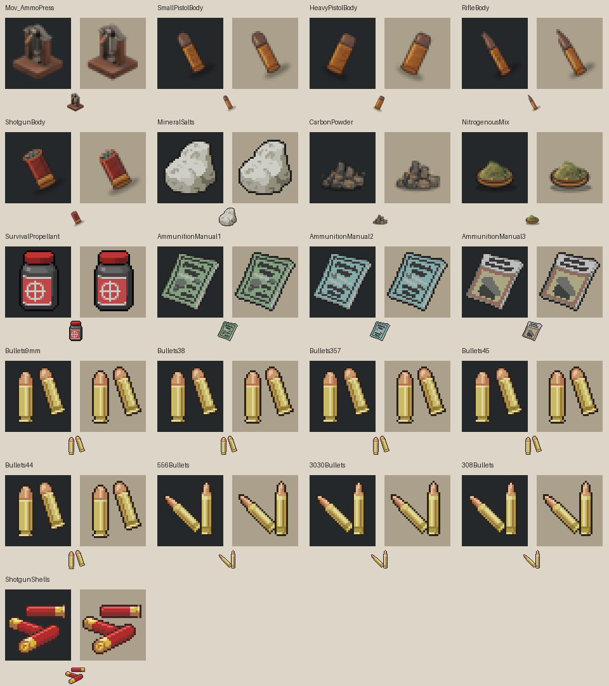
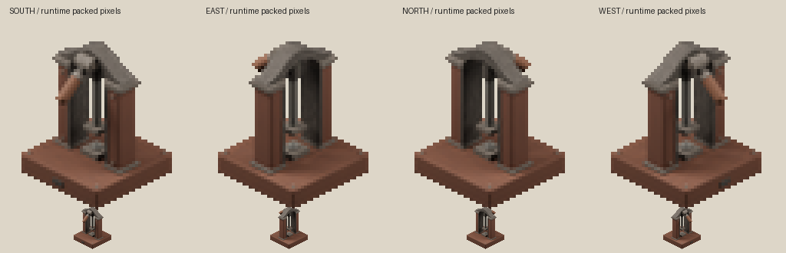
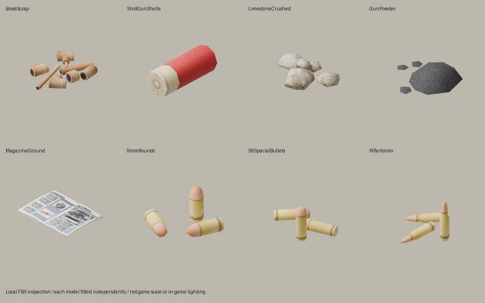

# 탄약 제작 모드 모델링 점검 — 2026-09-22

현재 가장 필요한 개선은 **제작 중간재의 전용 바닥 모델과 아이콘 간 일치**다.
프레스의 기본 형상·네 방향 배포 과정은 정상이며, 작은 화면에서의 작업부 식별성을
다듬으면 된다. 완성 탄약은 바닐라 자산을 유지하는 것이 현재 모드 구조에 맞는다.

## 점검 범위와 방법

- 대상: `AuxiliasAmmunition`의 12개 아이템(프레스 1, 탄약 몸체 4, 재료 4,
  교본 3)과 제작 결과인 바닐라 탄약 9종. 석궁 모드는 이번 평가에서 제외했다.
- 중앙 설정의 목표는 42.20 / 기존 시험 빌드 42.20.4다. 이번 점검은
  **Blender 원본·배포 파일·설치된 게임 자산 검사**이며 새 클라이언트 시험은 아니다.
- 프레스 `.blend`를 열어 수정자 적용 후 메시를 측정하고, 기존 렌더러로 네 방향을
  임시 경로에 다시 렌더했다. 원본은 저장하지 않았고 SHA-256이 유지되었다.
- 배포 `.pack`에서 실제 타일을 추출해 원본 타일과 비교했다. 전용 아이콘 7개와
  바닐라 아이콘을 원래 크기 및 최근접 확대, 밝고 어두운 배경에서 확인했다.
- 참조하는 고유 바닐라 바닥 모델 8개를 FBX로 가져와 텍스처를 연결해 렌더했다.
  비교판은 개별 모델을 화면에 맞춘 것이므로 상대 크기·바닥 접촉·게임 조명의 증거는 아니다.
- 코드·모델·아이콘·배포 자산은 변경하지 않았다. 보고서와 검토 자료만 추가했다.

## 전체 자산별 결과

우선순위의 **높음**은 아이템 정체성 혼동, **중간**은 축소 화면의 가독성·재질 일관성,
**낮음**은 선택적인 외형 구분을 뜻한다. 게임 충돌이나 로드 실패 등급은 아니다.

| 대상 / ID | 현재 표현과 확인 사항 | 권장 개선 | 우선순위 |
|---|---|---|---|
| 탁상형 탄약 프레스 / `Mov_AmmoPress` | 전용 3D 원본을 네 방향 2D 타일로 사용. 기둥·아치·램은 연결되어 있고 기준점과 크기도 일치. 49×55px 실물 영역에서는 손잡이·상부 축이 뭉치고 중앙 작업부가 작다. | 기존 비례를 유지하며 손잡이와 아치의 명도 차이, 램과 받침의 경계를 정리. 남/서 방향과 동/북 방향의 손잡이 읽힘을 함께 검수. | 중간 |
| 소형 권총 탄약 몸체 / `SmallPistolBody` | 아이콘은 단일 탄약 형태지만 바닥에서는 `Base.BrassScrap`의 배관 조각 묶음. | 짧고 가는 몸체 전용 모델. 완성탄과 구분되는 부품 묶음 또는 포장 표현을 아이콘과 함께 선택. | 높음 |
| 대형 권총 탄약 몸체 / `HeavyPistolBody` | 같은 황동 조각 모델. 아이콘은 굵기와 반대 기울기로 소형과 구분. | 짧고 굵은 비례를 바닥 모델에도 적용. 기울기만 달라도 구별되도록 하기보다 폭 차이를 주된 단서로 유지. | 높음 |
| 소총 탄약 몸체 / `RifleBody` | 역시 같은 황동 조각 모델. 아이콘의 긴 촉은 보이지만 작은 화면에서 소형 몸체와 색·외곽선이 유사. | 길고 좁은 실루엣 및 뚜렷한 목/어깨 형태. 바닥과 인벤토리에서 같은 비례 사용. | 높음 |
| 산탄총 탄약 몸체 / `ShotgunBody` | 열린 입구를 표현한 전용 아이콘. 바닥에서는 완성 산탄과 동일한 `Base.ShotGunShells`. | 열린 상단이나 부품 묶음이 보이는 전용 모델로 완성탄과 구분. 아이콘에서도 입구가 축소 후 남도록 정리. | 높음 |
| 분쇄한 광물 가루 / `MineralSalts` | `Limestone` 아이콘은 큰 돌 하나, `LimestoneCrushed` 바닥 모델은 흰 돌 조각 더미. 가루라는 이름에 비해 덩어리감이 강함. | 낮고 넓은 밝은 가루 더미로 아이콘·바닥 모델을 통일. 탄소와는 명도, 혼합물과는 용기로 구별. | 높음 |
| 탄소 가루 / `CarbonPowder` | 전용 아이콘은 각진 숯 조각 더미. 바닥에서는 `Base.GunPowder`의 회색 분말 더미로 야전 화약과 동일. | 검은 가루 중심에 작은 알갱이를 남긴 전용 표현. 야전 화약을 용기에 담으면 두 재료의 형태도 구분됨. | 중간 |
| 질소질 혼합물 / `NitrogenousMix` | 올리브색 혼합물이 담긴 얕은 그릇 아이콘. 바닥에서는 광물 가루와 같은 흰 돌 조각이 되어 그릇·색이 모두 사라짐. | 아이콘과 같은 낮은 그릇과 올리브색 내용물의 전용 모델. | 높음 |
| 야전 화약 / `SurvivalPropellant` | 붉은 뚜껑 용기 아이콘이지만 바닥 모델은 용기 없는 `Base.GunPowder`. 탄소 가루와도 동일. | 작은 용기 또는 묶은 주머니로 표현을 통일. 바닐라 화약과 다른 아이템임을 작은 표식/색으로 구분. | 높음 |
| 야전 탄약 제작 I / `AmmunitionManual1` | 녹색 무기 교본 아이콘, 공용 `Base.MagazineGround`의 펼친 잡지. | 현재 유지 가능. 필요하면 바닥에서도 등급을 알 수 있게 전용 표지/펼친 면 적용. | 낮음 |
| 야전 탄약 제작 II / `AmmunitionManual2` | 청색 교본 아이콘, I권과 같은 바닥 모델. | I권과 같은 메시를 공유하되 색·문양만 구분하는 방식이 적절. | 낮음 |
| 야전 탄약 제작 III / `AmmunitionManual3` | 금속가공 잡지 아이콘을 사용해 앞의 두 권과 주제가 다르게 읽힘. 바닥 모델은 동일. | 동일 시리즈의 표지 체계에 세 번째 색/문양 적용. 모델 자체의 새 제작은 후순위. | 낮음 |

각 칸의 큰 이미지는 배포 아이콘의 최근접 확대이며 아래 작은 이미지는 원래 크기다.
배경이 달라졌을 때 흐린 그림자와 외곽선이 얼마나 달라지는지 함께 비교했다.

## 프레스 세부 평가

| 부위 | 평가와 개선 방향 |
|---|---|
| 목재 받침 | 안정적인 사각 바닥과 네 방향 일관성은 장점. 작은 그림에서는 두꺼운 받침이 상당한 면적을 차지한다. 즉시 크기를 바꾸기보다 윗면/옆면 명도와 모서리를 다듬는 편이 기존 배치를 보존하기 쉽다. |
| 기둥·철제 보강 | 양쪽 기둥과 아치의 연결은 확인됨. 짙은 목재와 철판이 가까운 색으로 합쳐지므로 좁은 경계 강조가 유효. |
| 상부 아치·축·손잡이 | 고해상도에서는 구분되지만 배포 크기에서는 머리 부분이 한 덩어리로 읽힘. 특히 동/북에서 손잡이가 짧은 돌출부로만 남는다. 정적 네 방향 스프라이트에 필요한 실루엣 정리가 우선. |
| 수직 램 | 가는 밝은 선으로 남아 중앙 정렬은 읽힌다. 두께를 크게 늘리기보다 밝은 면을 안정적으로 유지할 것. |
| 상·하부 작업부 | 하부는 작은 팔각 다이, 상부는 사각 판이다. `TESTING.md`의 이전 ‘상하부 팔각 다이’ 설명은 현재 형상과 다르므로 최신 기준으로 정리할 필요가 있다. 작은 화면에서 상하 작업면의 대응 관계를 더 명확하게 하는 것은 유효한 미술 개선이다. |
| 표면·장식 | 고해상도 철 표면 요철과 리벳 상당수는 배포 크기에서 사라짐. 미세 흠집이나 볼트 수를 늘리는 작업보다 부위별 명도 구분이 효과적. |

실제 측정은 메시 38개, 수정자 적용 후 삼각형 5,532개,
가로×깊이×높이 약 **0.323×0.3255×0.43492m**다. 면적 0인 삼각형과
비정상 좌표는 발견하지 못했다. 이것은 기본 메시 검사이며 자가교차나 내부 작동 구조의
완전한 검증은 아니다. 게임에는 3D 프레스 메시가 아닌 타일 이미지가 들어가므로
이 삼각형 수를 게임 실행 성능 문제로 볼 근거는 없다.

네 방향을 새로 렌더한 결과는 보관된 768px 렌더와 **픽셀 단위로 모두 일치**했다.
배포 타일도 원본 타일과 보이는 색 및 알파가 일치하고, 알파는 0/255만 사용한다.
네 방향의 불투명 영역은 모두 `(40,130)–(89,185)`로 49×55px다.
메타데이터상 공통 받침 투영 크기는 약 50.12×31.33px이며 기준점도 동일하다.
이전의 방향별 크기 변경·반투명 체크무늬 문제를 현재 파일의 결함으로 재분류할 근거는 없다.
실제 테이블 위 접촉과 가림 관계는 별도 클라이언트 확인이 필요하다.

## 바닥 모델과 완성 탄약

이 그림은 각 형상을 비교하기 위한 Blender 검사 렌더다. 크기는 각각 화면에 맞췄으며
게임의 바닥 방향·배치 좌표·조명은 재현하지 않았다. `BrassScrap`은 스크립트에 별도
texture 필드가 없어 메시와 같은 이름의 실제 텍스처를 연결했다. 이를 텍스처 누락
오류로 판정하지 않았다. 참조한 8개 FBX와 해당 텍스처 파일은 모두 존재했다.

| 완성 탄약 | 현재 바닥 모델 | 판정 |
|---|---|---|
| 9mm / `Base.Bullets9mm` | `9mmRounds` | 바닐라 유지 |
| .38 / `Base.Bullets38` | `38SpecialBullets` | 바닐라 유지 |
| .357 / `Base.Bullets357` | `38SpecialBullets` | 바닐라 유지 |
| .45 / `Base.Bullets45` | `9mmRounds` | 바닐라 유지 |
| .44 / `Base.Bullets44` | `9mmRounds` | 바닐라 유지 |
| 5.56 / `Base.556Bullets` | `RifleAmmo` | 바닐라 유지 |
| .30-30 / `Base.3030Bullets` | `RifleAmmo` | 바닐라 유지 |
| .308 / `Base.308Bullets` | `RifleAmmo` | 바닐라 유지 |
| 산탄 / `Base.ShotgunShells` | `ShotGunShells` | 바닐라 유지 |

구경별 모델 공유는 설치된 바닐라 정의의 동작이다. 이 모드는 해당 `Base` 아이템을
제작 결과로 반환한다. 여기서 외형을 덮어쓰면 제작탄뿐 아니라 동일한 바닐라 아이템의
표현도 달라지므로, 중간재 개선과 분리하는 것이 맞다. 현재 검사에서 완성탄 자산을
교체해야 할 파일 누락이나 참조 오류는 발견하지 못했다.

## 아이콘과 제작 파이프라인

전용 아이콘은 바닐라에서 가져온 광물·용기·교본보다 외곽이 부드럽고 저대비다.
소형 몸체는 알파가 0보다 큰 277픽셀 중 231픽셀, 소총 몸체는 248픽셀 중 208픽셀이
반투명이다. 그림자와 안티앨리어싱도 포함된 수치이며, 그 자체가 깨진 파일이라는 뜻은
아니다. 다만 실제 비교판에서 작은 물체가 흐리게 읽히는 현상과 함께 개선 근거가 된다.

몸체 네 아이콘의 낮은 알파 그림자는 캔버스 아래 가장자리까지 도달한다.
산탄 몸체는 오른쪽 가장자리에도 닿는다. 본체가 잘렸다는 판정은 아니며,
새 아이콘에서는 그림자를 줄이고 한 픽셀 이상의 투명 여백을 확보하면 된다.
일괄 알파 문턱 적용만으로 고치면 가는 촉이나 외곽선이 사라질 수 있으므로,
32px 원래 크기에서 픽셀 덩어리·대비·실루엣을 먼저 정리하는 편이 좋다.

후속 작업 시 함께 정리할 제작 과정은 다음과 같다.

- `build-press-art.py`는 Lanczos로 프레스 배포 아이콘을 직접 쓰고,
  `sync-icons.ps1`은 같은 마스터를 GDI+ bicubic으로 다시 쓴다. 현재 파일의 오류라는
  뜻은 아니지만 실행 순서에 따라 결과가 달라질 수 있어 최종 축소 경로를 하나로 정할 것.
- 현재 검증기는 아이콘 크기·파일 고유성·최대/최소 알파를 검사하지만,
  작은 그림의 구별 가능성, 전용 바닥 모델, 타일 원본/pack 픽셀 일치까지 보증하지 않는다.
- 산탄 몸체에 `Base.ShotGunShells`를 강제하는 검증 규칙이 있다.
  전용 모델 도입 때 이 규칙도 새 모델 참조·파일 검증으로 바꿔야 한다.
- 프레스 생성기, `.blend`, 원본 렌더, 타일, pack의 해시와 설정을 함께 남기면
  이후에도 이번처럼 ‘현재 원본에서 만든 배포 파일인지’를 확인하기 쉽다.

## 권장 작업 순서와 완료 기준

1. **몸체 4종의 바닥 모델 제작**: 소형·대형·소총·산탄의 실루엣 구분과 아이콘 일치.
   메시/재질은 가능한 범위에서 공유하고 공개 아이템 ID는 유지한다.
2. **재료 4종의 표현 통일**: 밝은 가루, 검은 가루, 올리브색 그릇, 용기/주머니의
   네 가지 형태를 인벤토리와 바닥에서 일관되게 사용한다.
3. **아이콘 선명도와 프레스 소형 표현 수정**: 고해상도보다 32px 아이콘 및 49×55px
   프레스 실물 영역에서 먼저 합격시킨다. 교본 시리즈화는 그 다음이다.
4. **클라이언트 검수**: 밝은/어두운 바닥에 중간재와 완성탄을 나란히 놓고 구분,
   크기·바닥 접촉·회전 확인. 프레스는 네 방향, 서로 다른 테이블, 줍기/재설치,
   저장/재접속 후 표시를 확인한다. 기존 메뉴 동작 시험을 이 외형 시험 대신 쓰지 않는다.

측정 자료는 [JSON](MODEL-REVIEW-2026-09-22.measurements.json)에 남겼다.
보고서 추가 후 루트 `tools/validate.ps1`을 실행해 등록된 모드 3개가 모두 통과했다.
이는 기존 정적 검증의 결과이며 앞서 구분한 새 클라이언트 외형 시험을 대체하지 않는다.
임시 감사 스크립트와 원본 크기의 검사 렌더는 저장소의
`work/ammo-model-review-2026-09-22`에 있다. 이번에 확인한 파일 구조와 시각 문제를
정리한 보고서이며, 권장 개선은 아직 적용하지 않았다.
