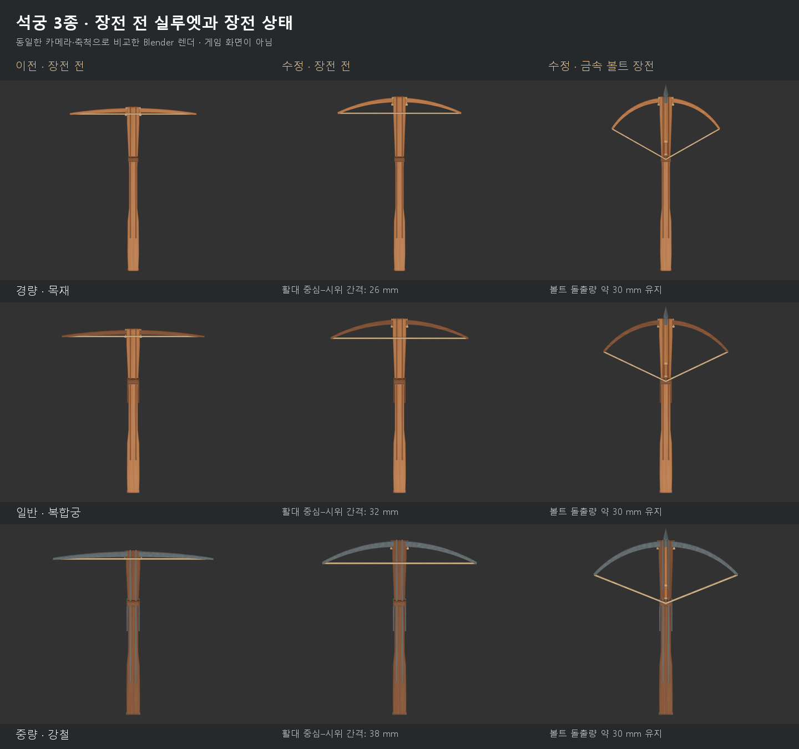
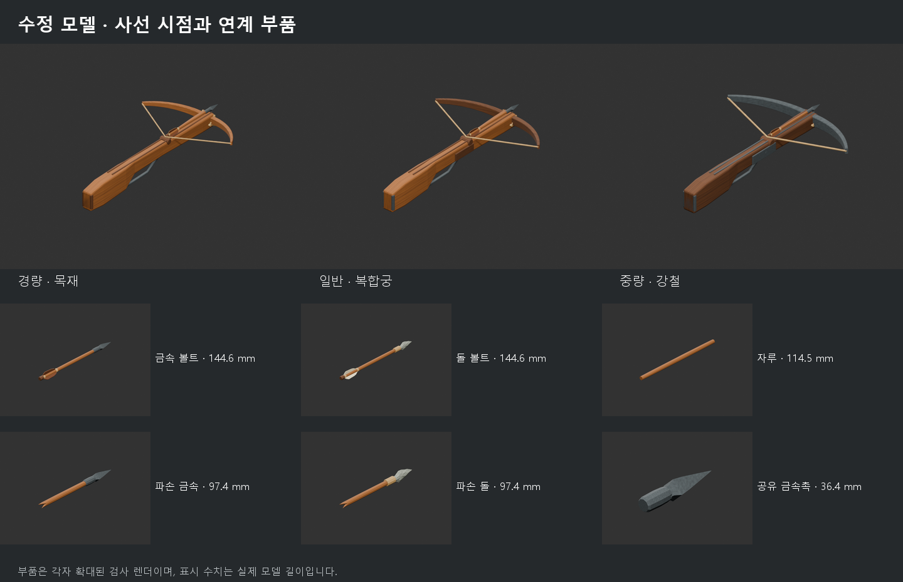
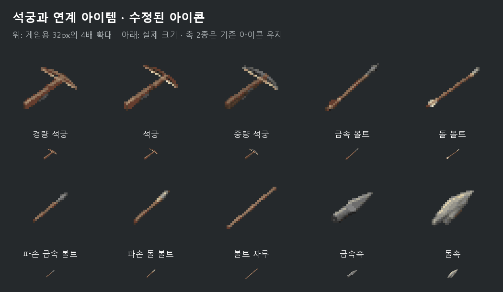
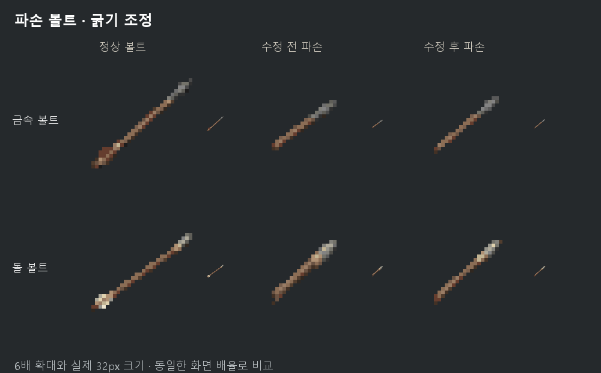

# 석궁·연계 아이템 디자인 수정 — 2026-09-19

## 적용 결과

장전 전 석궁을 **시위가 걸려 있고 당겨지지 않은 상태(braced)**로 표현했다.
세 활대 모두 완만한 곡선을 가지며, 뒤쪽의 직선 시위와 사이에 빈 공간이 생긴다.
장전 시 활대 끝은 뒤쪽·안쪽으로 이동하고 시위는 기존 걸쇠까지 당겨진다.

| 구분 | 이전 장전 전 활대 중심–시위 간격 | 수정 후 | 장전 전 전체 길이 | 장전 후 볼트 포함 |
|---|---:|---:|---:|---:|
| 경량 / 목재 | 약 7.4 mm | 26 mm | 321 → 341 mm | 약 364 mm |
| 일반 / 복합궁 | 약 8.3 mm | 32 mm | 321 → 341 mm | 약 364 mm |
| 중량 / 강철 | 약 9.4 mm | 38 mm | 322 → 342 mm | 약 364 mm |

수치는 **게임의 기존 소형 무기 좌표계에 맞춘 모델 치수**다. 역사 유물의 실측치나
무기 성능 계산값으로 해석하지 않는다. 손을 받치는 Y=0.060~0.150 구간,
개머리판 뒤끝과 걸쇠 위치를 유지하면서 앞몸통·활대 결합부만 20 mm 앞으로 옮겼다.
새 곡선에 필요한 시위 당김 거리와 볼트 촉의 돌출량을 함께 맞춘 선택이다.

## 역사 자료와 해석

- [Cleveland, Crossbow, 1460–70](https://www.clevelandart.org/art/1916.1725):
  중세 후기 목제 몸통과 복합궁 구성, 볼트 홈과 걸쇠 주위의 간결한 실루엣을 참고했다.
- [Met, Crossbow, 1425–75](https://www.metmuseum.org/art/collection/search/23336):
  복합궁의 활대 단면과 목제 몸통 비례를 참고했다.
- [KHM, Armbrust, 1499–1514](https://www.khm.at/kunstwerke/armbrust-373822):
  후기 중세에서 16세기 초에 걸친 강철궁 사례. 굽은 활대와 그 뒤의 직선 시위가
  분리되어 보이는 형태를 중량 석궁의 장전 전 실루엣에 반영했다.
- [KHM, horn-composite crossbow](https://www.khm.at/kunstwerke/armbrust-mit-hornkompositbogen-372861)와
  [Met, Count Ulrich V 연구](https://resources.metmuseum.org/resources/metpublications/pdf/The_Crossbow_of_Count_Ulrich_V_of_Wurttemberg_The_Metropolitan_Museum_Journal_v_44_2009.pdf):
  시위가 없는 보존 상태를 발사 직후 상태로 오해하지 않도록 구분했다.
  몸통 앞의 활대 결합, 결속 구멍과 수직 보강핀 구성도 참고했다.

동일 유물의 장전 전후 사진 한 쌍을 확보한 것은 아니다. 유물 사진은 **형태와
재료의 근거**로 사용했고, 장전 상태는 실제 모델의 활대·시위 길이를 유지하도록
기하학적으로 풀었다. 목재 → 복합궁 → 강철궁은 게임 등급별 시각 구분이며,
세 유물을 그대로 복제한 역사 복원품은 아니다.

## 함께 수정한 아이템

| 아이템 | 이전 길이 | 수정 길이 | 수정 내용 |
|---|---:|---:|---|
| 금속·돌 볼트 | 약 124.6 mm | 약 144.6 mm | 깃과 촉 사이의 자루를 20 mm 연장 |
| 제작용 볼트 자루 | 94.5 mm | 114.5 mm | 완성 볼트와 같은 자루 메시 공유 |
| 파손 금속·돌 볼트 | 약 80.7 mm | 약 97.4 mm | 같은 자루 변형을 적용한 앞쪽 조각, 전체의 약 67% |
| 금속촉·돌촉 | 약 36.4 / 28.9 mm | 동일 | 완성품·파손품·제작 부품에서 실제 촉 메시 공유 |

장전 볼트는 바닥 아이템과 동일한 메시를 **배율 1.0, 평행 이동만**으로 사용한다.
여섯 장전 모델 모두 촉은 활대 결합부보다 약 30 mm 앞으로 나오고,
시위 앞면과 볼트 뒤끝이 접한다. 자루 두께, 촉 크기, 깃 크기는 유지했다.
파손품과 제작 부품의 길이 중심도 다시 맞췄다.

## 아이콘

석궁 3종, 완성 볼트 2종, 파손 볼트 2종, 자루의 **8개 아이콘**을 새 모델에 맞춰
built-in ImageGen으로 각각 생성했다. 형상이 유지된 촉 2종은 기존 아이콘을 쓴다.
모델 렌더는 형태 참고, 로컬에서 확인한 바닐라 아이콘은 스타일 참고로 사용했다.

원본은 [generated](../source-assets/icons/generated/)에, 실제 프롬프트와 참고 경로는
[generation-prompts.json](../source-assets/icons/generation-prompts.json)에 보존했다.
기존 준비·동기화 도구로 24색 팔레트와 이진 알파를 적용하고, 128px 픽셀 마스터와
32px 배포본을 만들었다. 비교표는 게임 스크린샷이 아니다.

## 검증

### 파손 볼트 아이콘 후속 수정

사용자 검토에서 파손 볼트가 굵어 보이는 문제가 확인되어 금속·돌 아이콘의 자루,
촉과 결속부 폭을 줄였다. 짧은 앞쪽 조각과 파손면은 유지한다. 정상 볼트와 함께
32px로 비교했으며, 이번 후속 수정에서는 두 파손 아이콘만 변경되었다.
수정 전 생성 원본은 `source-assets/icons/generated/history/2026-09-19-before-slimming/`에
보존했다. 전체 아이콘 미리보기와 해시 기록은 후속 수정본으로 갱신했다.

### 검사 결과

- Blender 원본에서 16개 자산을 내보내고 FBX 재가져오기 시 좌표·UV·재질을 비교했다.
  모든 자산에서 형상/UV 일치, 퇴화 삼각형 및 붕괴 UV 없음, 원본 파일 보존을 확인했다.
- 시위·활대의 단면 링을 직접 측정한다. 세 등급의 장전 전후 시위 길이 차이는
  최대 약 2.8×10⁻⁸ m, 활대 중심선 길이 차이는 최대 약 3.3×10⁻⁸ m였다.
- 시위–볼트 접촉 오차는 최대 약 1.1×10⁻⁸ m, 볼트와 몸통·홈의 최소 여유는
  약 0.258 mm였다. 장전/바닥 볼트 치수 차이는 0.001 mm 미만이다.
- 정상 원본과 의도적 오류 4가지(시위 이탈, 잘못된 걸쇠 메타데이터, 활대 길이 변형,
  장전 볼트 메시 연결 해제)를 검사했다. 정상은 통과하고 오류는 각각 거부되었다.
- 아이콘 10개의 크기, 0/255 알파, 최소 1픽셀 여백, 색 수, 고유 해시 및
  마스터/배포 픽셀 일치를 확인했다.
- 루트 `tools/validate.ps1`에서 등록된 모드 3개가 모두 통과했다.
- `tools/package.ps1 -Mod auxilias-crossbow`로 별도 후보 디렉터리에 패키지를
  만들고 내용·체크섬 감사를 통과했다. 버전은 기존 개발 버전 0.2.0을 유지한다.
  파손 아이콘 후속 수정을 포함한 저장 위치는
  `dist/auxilias-crossbow/design-refresh-2026-09-19-slim-icons/AuxiliasCrossbow-0.2.0.zip`,
  SHA-256은 `f2395c254b26af41701f454c4dec5bf15b009c442377ab48d6b65d811e0bff63`이다.

상세 수치는 [모델 측정 결과](DESIGN-REFRESH-2026-09-19.measurements.json)와
[아이콘 검사 결과](DESIGN-REFRESH-2026-09-19.icons.json)에 있다.

이번 검증은 Blender, FBX, PNG와 배포 트리까지다. **새 치수로 실제 게임을 실행해
좌우 조준, 등 장착, 장전·발사 전환, 바닥 배치와 제작 소품을 확인하는 검사는
아직 수행하지 않았다.** 이전 버전의 클라이언트 통과 기록은 이번 형상의 검증으로
간주하지 않는다. 게임 성능·레시피·아이템 ID·장착 좌표는 변경하지 않았다.
