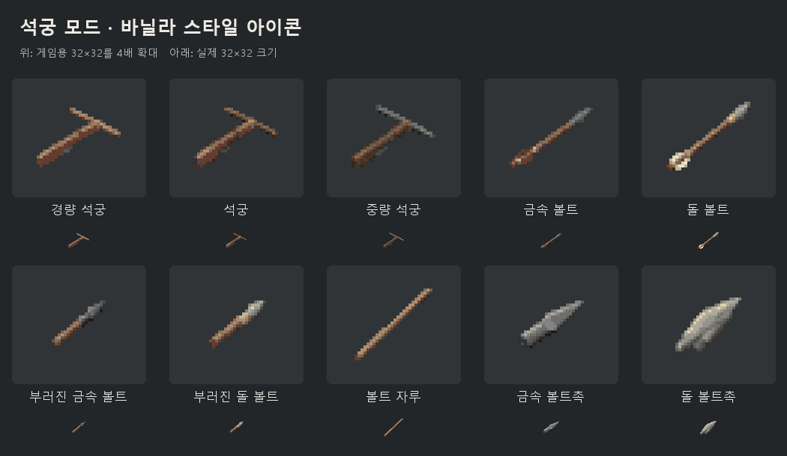

# 바닐라 스타일 아이템 아이콘 교체 — 2026-09-18

석궁 3종, 정상/파손 볼트 4종, 자루/금속촉/돌촉 3종의 아이콘을 교체했다.
검토 대상은 프로젝트 설정의 Project Zomboid 42.20.4 설치 파일과 현재 모드의
Blender 검토 렌더다. 기존 아이템 ID와 `Icon` 참조를 그대로 사용한다.



## 조사한 자료

바닐라 자료는 설치 디렉터리의 `media` 아래에서 읽었으며, 추출한 바닐라 이미지는
배포 트리나 아이콘 원본에 포함하지 않았다.

| 비교 항목 | 실제 파일/아이템 | 확인 내용 |
|---|---|---|
| 소총/산탄총 아이콘 | `texturepacks/UI2.pack`의 `Item_RifleHunting`, `Item_ShotgunDoublebarrelSawn` | 대각선 구도, 작은 색 덩어리, 제한된 금속 하이라이트 |
| 창과 파손 자루 | `Item_SpearStick`, `Item_Spear_Forged_02`, `Item_Spear__StoneCrude01`, `Item_LongHandle_Broken` | 가는 물체의 굵기, 목재/촉의 경계, 파손 조각의 길이 |
| 제작 부품 | `Item_Handle`, `Item_SpearHead_Forged_02`, `Item_SpearHead_Stone_Crude01` | 목재 갈색, 단조 금속 회색, 돌의 넓은 명암면 |
| 목제 손잡이 모델 | `models_X/WorldItems/HandleWooden_Small.fbx`, `textures/WorldItems/HandleWooden_Small.png` | 각진 단순 형상과 길이 방향의 목재 질감. 직접 불러와 렌더 |
| 돌촉 모델 | `models_X/WorldItems/Spear_Stone_Basic_Head.fbx`, `textures/weapons/2handed/Spear_Stone_Basic.png` | 얇은 잎 모양 단면과 박리면. 직접 불러와 렌더 |
| 깨진 돌 모델 | `models_X/WorldItems/ChippedStone.FBX`, `textures/WorldItems/Stone_ChippedStone.png` | 불규칙한 돌 덩어리와 제작된 촉의 차이. 직접 불러와 렌더 |
| 바닐라 총기 모델 화면 | 기존 `work/vanilla-firearm-reference/hunting-rifle-right.png` | 이전 42.20.2 클라이언트의 형태 참고. 이번 변경의 실행 검증으로 사용하지 않음 |
| 모드 모델 | `work/model-validation`의 3종 비장전 석궁과 7개 볼트/부품 렌더 | 활대 재질, 몸통, 시위, 촉, 깃, 파손면을 각각 확인 |

바닐라 소총·손잡이·단조 창촉은 모두 32×32 캔버스와 0/255 알파를 사용했고,
보이는 RGB 색상 수는 각각 11/7/5개였다. 이에 맞춰 과도한 광택과 부드러운
가장자리를 줄이고, 재질별로 제한된 명암을 사용하는 픽셀 표현을 선택했다.

## 적용한 표현

- 경량 석궁은 밝은 목제 활대, 일반 석궁은 어두운 합성 활대, 중량 석궁은
  회색 강철 활대와 철제 보강판으로 구분한다. 세 아이콘 모두 현재 비장전 모델의
  목제 몸통, 긴 아래쪽 방아쇠와 단순한 시위를 따른다.
- 금속 볼트는 회색 촉과 갈색 깃, 돌 볼트는 밝은 돌촉과 흰 깃을 사용한다.
- 파손 볼트는 깃 없는 앞쪽 조각이며, 정상 아이콘 폭의 약 68%로 표시한다.
  파손면은 자루에 붙어 있으며 별도의 나무 조각을 덧붙이지 않는다.
- 자루는 가늘게 깎은 나무 막대, 금속촉은 소켓과 각진 촉, 돌촉은 넓은 박리면으로
  서로 구별한다. 작은 부품은 인벤토리에서 식별할 수 있도록 별도로 확대한다.

## 원본과 재생성

`source-assets/icons/generated/`에 built-in `image_gen.imagegen`으로 만든
원본 PNG 10개를 보존했다. 아이콘마다 별도 생성 호출을 사용했으며, 프롬프트 전체와
참고 이미지 역할은 `source-assets/icons/generation-prompts.json`에 기록했다.
모드 모델은 형태 참고로, 바닐라 아이콘은 스타일 참고로만 사용했다.

PowerShell 7에서 다음 순서로 원본을 배포용 파일로 변환한다.

```powershell
& mods/auxilias-crossbow/tools/prepare-icon-masters.ps1
& mods/auxilias-crossbow/tools/sync-icons.ps1
& tools/validate.ps1
```

첫 단계는 생성 원본의 가시 영역을 맞추고 32픽셀로 축소한 다음 공통 재질 색상
24개와 이진 알파로 양자화한다. 그 결과를 정확히 4배 확대한 128×128 원본으로
저장한다. 동기화는 nearest-neighbor를 사용해 32×32 배포 이미지에 흐림이 생기지
않게 한다. 모델 내보내기는 이 이미지들을 재생성하지 않는다.

## 검증 결과와 범위

- 128×128 원본 10개와 32×32 배포 파일 10개를 확인했다.
- 원본을 nearest-neighbor로 축소한 픽셀이 배포 파일과 정확히 일치한다.
- 모든 배포 아이콘에 0/255 알파, 최소 1픽셀 외곽 여백, 서로 다른 파일 해시가 있다.
- 기존 파일과 10개 모두 달라졌으며, 실제 크기와 확대 크기에서 전체 세트를 확인했다.
- 모노레포 `tools/validate.ps1`로 등록된 3개 모드 검증을 통과했다.
- 3D 모델·아틀라스·아이템 스크립트·레시피·게임 동작은 이번 수정의 변경 파일에 없다.

이번 결과는 PNG와 배포 트리의 정적 검사 및 시각 비교까지다. 새 아이콘으로
클라이언트를 실행하거나 실제 사용자 설치 폴더에 배포한 결과는 포함하지 않는다.
작업 중 비교표, 바닐라 추출 자료, 모델 렌더와 픽셀/해시 감사 결과는
`work/icon-refresh/`에 있다. 이 문서의 미리보기는 아이콘 비교 이미지이며 게임
스크린샷이 아니다.
